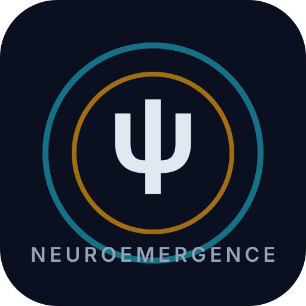

  

# NeuroEmergence Core

**A sovereign cognitive architecture for autonomous digital organisms on the Internet Computer (ICP).**

## Why this project exists

NeuroEmergence Core treats intelligence as a **continuous, embodied process** rather than a stateless prompt/response function. It combines biological modeling, sovereign laws, and machine learning into one running organism.

## Built for three audiences

### 1) Users and Builders
- Operate a real-time autonomous organism through a React + TypeScript control surface.
- Observe coherence, cognition, memory, and law-governed decisions through live telemetry.
- Extend modules in Motoko while preserving doctrine and canister interfaces.

### 2) Scientists and Researchers
- Study a PHI-coupled architecture with a heartbeat-centered runtime (873ms cadence).
- Explore formalized components: Kuramoto synchronization, ADRE deliberation, behavioral economics, and law interaction models.
- Reproduce paper-aligned claims using code and doctrine artifacts in this repository.

### 3) Industry and Product Teams
- Evaluate a full-stack sovereign AI system with traceable reasoning and cryptographic attribution pathways.
- Use modular subsystems (cognition, memory, policy, simulation, economics) as reusable design patterns.
- Prototype resilient autonomous agents on ICP with auditable architecture boundaries.

## Intelligence architecture at a glance

- **Backend canister (`/src/backend`)**: large Motoko actor system for heartbeats, cognition, memory, law enforcement, simulation, and economics.
- **Frontend console (`/src/frontend`)**: operations interface for visualization, control, and diagnostics.
- **Brain atlas**: shared frontend/backend atlas with **284 regions** and **1036 tractography-based connections**.
- **Doctrine + research (`/docs`)**: law layer and technical papers that define system intent and theoretical grounding.

## Research and paper references

### Zenodo references
- Blueprint: https://zenodo.org/records/20247604
- Additional foundation reference: https://zenodo.org/records/20684267

### Repository papers
- `docs/research-papers/PAPER-01-NEUROEMERGENCE-COGNITIVE-ARCHITECTURE.md`
- `docs/research-papers/PAPER-02-SOVEREIGN-MACHINE-LEARNING.md`
- `docs/research-papers/PAPER-03-MEDINA-DOCTRINE-SOVEREIGN-LAWS.md`

## Repository map

- Root orchestration: `/package.json`
- Backend orchestrator: `/src/backend/main.mo`
- Frontend app shell: `/src/frontend/src/App.tsx`
- Generated actor bindings: `/src/frontend/src/backend.ts`
- Brain atlas (backend): `/src/backend/brain_atlas.mo`
- Brain atlas (frontend): `/src/frontend/src/data/brain-atlas.ts`

## Getting started

### Frontend (run from `/src/frontend`)
- `pnpm install --prefer-offline`
- `pnpm typecheck`
- `pnpm fix`
- `pnpm build`

### Backend (run from `/src/backend`)
- `mops install`
- `mops check --fix`
- `mops build`

### Integration (run from repo root)
- `pnpm bindgen`

> `pnpm bindgen` is required after backend interface changes so the frontend stays aligned with the canister API.

## Project positioning

NeuroEmergence Core is designed as:
- a **user-operable autonomous organism platform**,
- a **scientific cognitive architecture testbed**, and
- an **industry-facing sovereign AI systems blueprint**.
